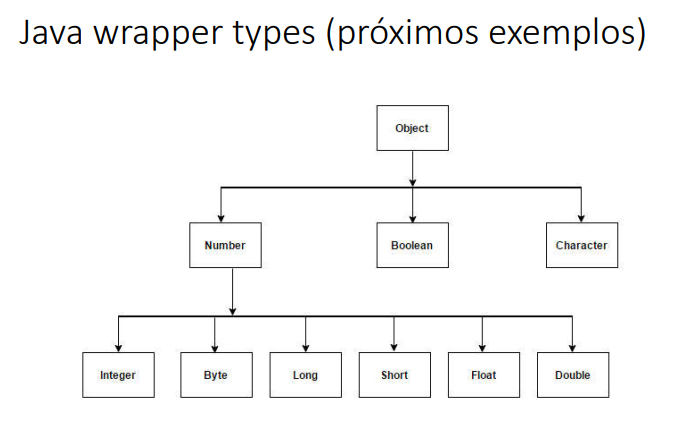
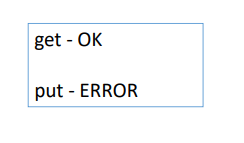
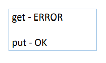

# GenericsCuringasDelimitados2

## Princípio get/put
Vamos fazer um método que copia os elementos de uma lista para uma
outra lista que pode ser mais genérica que a primeira.
```java

List<Integer> myInts = Arrays.asList(1, 2, 3, 4);
List<Double> myDoubles = Arrays.asList(3.14, 6.28);
List<Object> myObjs = new ArrayList<Object>();

copy(myInts, myObjs);
copy(myDoubles, myObjs);
```

https://stackoverflow.com/questions/1368166/what-is-a-difference-between-super-e-and-extends-e

Resolução:
```java
package application;

import java.util.ArrayList;
import java.util.Arrays;
import java.util.List;

public class Exercicio {

	public static void main(String[] args) {

		List<Integer> myInts = Arrays.asList(1, 2, 3, 4);
		List<Double> myDoubles = Arrays.asList(3.14, 6.28);
		List<Object> myObjs = new ArrayList<Object>();

		copy(myInts, myObjs);
		printList(myObjs);
		
		copy(myDoubles, myObjs);
		printList(myObjs);
	}

	public static void copy(List<? extends Number> source, List<? super Number> destiny) {
		for (Number number : source) {
			destiny.add(number);
		}
	}

	public static void printList(List<?> list) {
		for (Object obj : list) {
			System.out.print(obj + " ");
		}
		System.out.println();
	}
}
```
<p align="center">
    
</p>

## Princípio get/put - covariância

```java
List<Integer> intList = new ArrayList<Integer>();
intList.add(10);
intList.add(5);

List<? extends Number> list = intList;

Number x = list.get(0);

list.add(20); // erro de compilacao
```
<p align="left">
    
</p>

## Princípio get/put - contravariância
```java
List<Object> myObjs = new ArrayList<Object>();
myObjs.add("Maria");
myObjs.add("Alex");

List<? super Number> myNums = myObjs;

myNums.add(10);
myNums.add(3.14);

Number x = myNums.get(0); // erro de compilacao
```
<p align="left">
    
</p>
